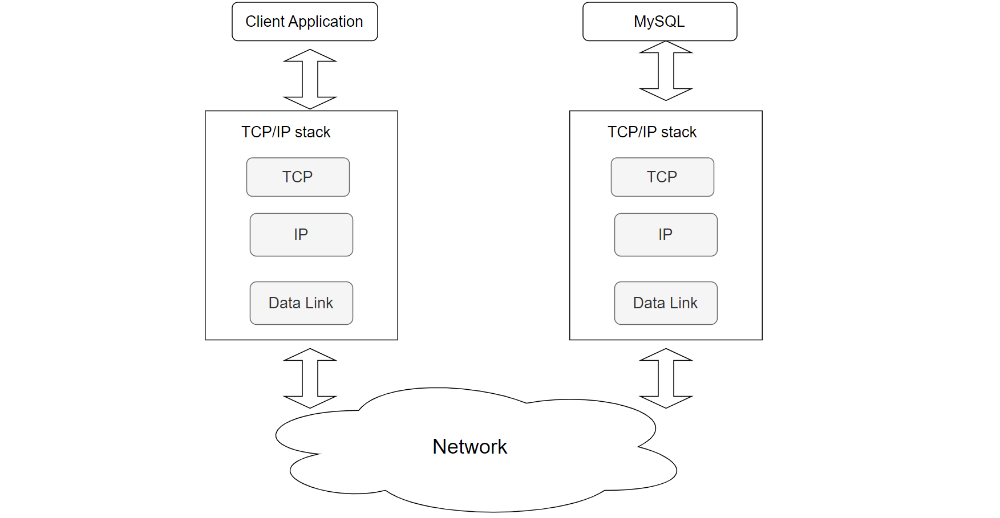
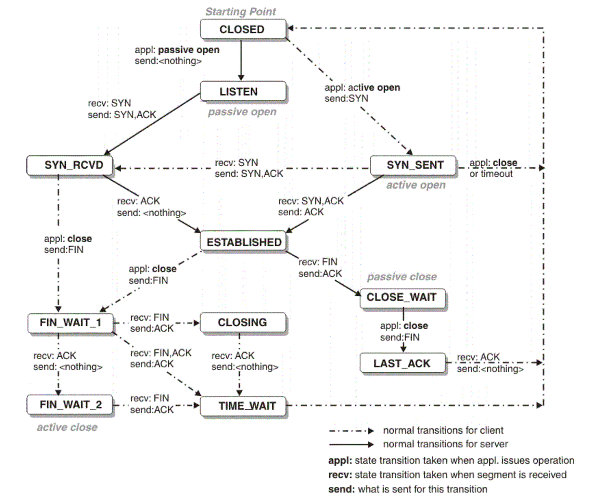
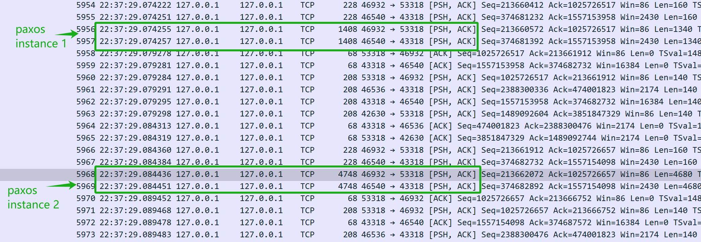
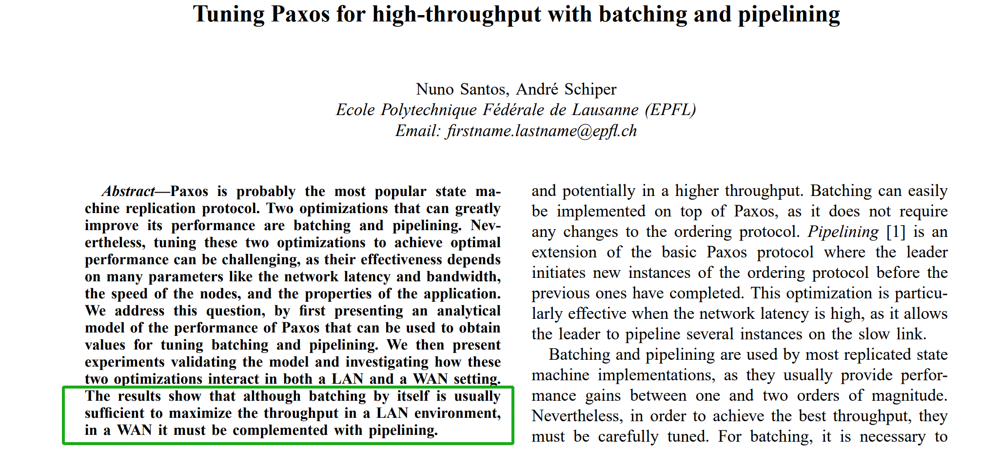

## 4.7 Computer Networking

Computer networking can be considered a branch of computer science, computer engineering, and telecommunications, as it relies on the theoretical and practical application of these disciplines. The field has been shaped by numerous technological developments and historical milestones [45].

In schools, networking courses often teach the theory, but they don't usually show students how to actually analyze and solve network problems. Consequently, when problems arise, many feel lost and lack the logical thinking skills needed for effective problem-solving. While network knowledge can be acquired at any time, identifying the correct approach to problem-solving requires extensive practice. A correct approach ensures smooth problem resolution, whereas a wrong direction can significantly increase the difficulty of solving problems.

This section discusses common theories, techniques, network partitioning, and logical reasoning used to address MySQL-related problems in the context of networking.

### 4.7.1 FLP Impossibility Theory

In a fully asynchronous message-passing distributed system with potential process crash failures, the 1985 FLP impossibility result by Fischer, Lynch, and Paterson proves that achieving consensus with a deterministic algorithm is impossible. However, practitioners often disregard this result because real systems usually exhibit some level of synchrony. The worst-case scheduling scenarios posited by the FLP result are unlikely to occur in practice, except in adversarial situations like an intelligent denial-of-service attack [46].

The FLP impossibility theorem is valuable in problem-solving as it highlights the challenge of distinguishing between lost and delayed messages in a network. In practice, while message delays are typically bounded, delays in systems like MySQL can be prolonged, making it difficult to tell if a node's information is lost or simply delayed. Misjudgments here can lead to errors, such as Group Replication incorrectly reporting nodes as unreachable.

The Mencius algorithm used in Group Replication addresses the FLP impossibility by using a failure detector oracle to bypass the result. Like Paxos, it relies on the failure detector only for liveness. Mencius requires that eventually, all and only faulty servers are suspected by the failure detector. This can be achieved by implementing failure detectors with exponentially increasing timeouts [32].

To avoid the problems posed by the FLP impossibility, careful design is needed. TCP, for example, addresses this with timeout retransmission and idempotent design, ensuring that even if duplicate messages are received due to transmission errors, they can be safely discarded.

### 4.7.2 TCP/IP Protocol Stack

The Internet protocol suite, commonly known as TCP/IP, organizes the set of communication protocols used in the Internet and similar computer networks [45]. It provides end-to-end data communication, specifying how data should be packetized, addressed, transmitted, routed, and received. The suite is divided into four abstraction layers, each classifying related protocols based on their networking scope:

1.  **Link Layer**: Handles communication within a single network segment (link).
2.  **Internet Layer**: Manages internetworking between independent networks.
3.  **Transport Layer**: Facilitates host-to-host communication.
4.  **Application Layer**: Enables process-to-process data exchange for applications.

An implementation of these layers for a specific application forms a protocol stack. The TCP/IP protocol stack is one of the most widely used globally, having operated successfully for many years since its design. The following figure illustrates how a client program interacts with a MySQL Server using the TCP/IP protocol stack.



Figure 4-34. A client program interacts with a MySQL Server using the TCP/IP protocol stack.

Due to the layered design of the TCP/IP protocol stack, a client program typically interacts only with the local TCP to access a remote MySQL server. This design is elegant in its simplicity:

1.  **Client-Side TCP**: Handles sending SQL queries end-to-end to the remote MySQL server. It manages retransmission if packets are lost.
2.  **Server-Side TCP**: Receives the SQL queries from the client-side TCP and forwards them to the MySQL server application. After processing, it sends the response back through its TCP stack.
3.  **Routing and Forwarding**: TCP uses the IP layer for routing and forwarding, while the IP layer relies on the data link layer for physical transmission within the same network segment.

Although TCP ensures reliable transmission, it cannot guarantee that messages will always reach their destination due to potential network anomalies. For example, SQL requests might be blocked by a network firewall, preventing them from reaching the MySQL server. In such cases, the client application might not receive a response, leading to uncertainty about whether the request was processed or still in transit.

To address these problems, additional tools like packet capture can help determine if SQL requests have reached the MySQL server, thereby clarifying the situation.

### 4.7.3 TCP State Machine

The following figure depicts the classic TCP state machine used for transitions between TCP states.



Figure 4-35. Classic TCP state machine overview.

A flexible understanding of state transitions is crucial for troubleshooting MySQL network problems. For example:

-   **CLOSE_WAIT State**: A large number of *CLOSE_WAIT* states on the server indicates that the application did not close connections promptly or failed to initiate the close process, causing connections to linger in this state.
-   **SYN_RCVD State**: Numerous *SYN_RCVD* states may suggest a SYN flood attack, where an excessive number of SYN requests overwhelm the server's capacity to handle them effectively.

Understanding these state transitions helps in diagnosing and addressing network-related problems more effectively.

### 4.7.4 Will Data Content Be Corrupted During Network Transmission?

Many software professionals analyzing MySQL network problems often suspect data corruption during transmission, leading to questions about TCP reliability.

In the TCP/IP protocol stack, IP networks are unreliable, while TCP ensures reliability. How does TCP ensure reliable transmission to the user program? There are two main scenarios: packet loss and data corruption. When facing packet loss in an IP network, TCP employs a mechanism called timeout and retransmission. According to the FLP impossibility theorem, even if intermediate devices introduce delays, retransmitted data packets, including those from before, are likely to reach the destination. TCP achieves idempotency in receiving information based on sequence numbers and payload lengths, effectively solving problems caused by packet loss and delay. For data corruption, TCP uses checksum verification. If a discrepancy is detected, corrupted data is discarded, and the sender retransmits the data.

However, TCP transmission is not immune to security risks. Checksum verification is provided, but it can't ensure security against intentional tampering by intermediate devices that alter both payload and checksum simultaneously. This is why TLS/SSL protocols were developed to enhance data security, though they can complicate problem analysis in typical situations.

### 4.7.5 Batching and Pipelining

Paxos is a widely used state machine replication protocol, and its performance can be significantly enhanced through batching and pipelining optimizations. However, tuning these optimizations for optimal performance can be complex, as their effectiveness is influenced by various factors including network latency and bandwidth, node speeds, and application properties.

Below is a comparison test in LAN environments using BenchmarkSQL for TPC-C. There are 1000 warehouses, and concurrency ranges from 50 to 2000. Deep blue represents throughput without batching, while deep red represents throughput with batching.


Figure 4-36. Effect of batching on Paxos algorithm performance in LAN environments.

From the figure, it is clear that batching significantly increases throughput under high concurrency. In a LAN environment, does pipelining also have a similar effect? The following figure presents comparative tests conducted without batching to evaluate whether pipelining alone can also substantially boost throughput.


Figure 4-37. Effect of pipelining on Paxos algorithm performance in LAN environments.

From the figure, it is clear that while pipelining does improve TPC-C throughput in LAN environments, the improvement is relatively modest. Interestingly, in LAN environments with batching already enabled, adding pipelining offers little additional benefit, as shown in the following figure.


Figure 4-38. Effect of pipelining on batched Paxos algorithm performance in LAN environments.

How does pipelining perform in WAN environments? Let's explore its impact. The following figure shows the throughput of 1000 concurrency under different numbers of pipelining, with a network latency of 10ms and Paxos algorithm enabling batching.


Figure 4-39. Effect of pipelining on batched Paxos algorithm performance in WAN environments.

From the figure, it is clear that with just one pipelining, throughput is relatively low at 60,051 tpmC. With ten pipelinings, throughput increases significantly to 476,783 tpmC. However, increasing the pipelining to twenty shows little difference compared to having 10 pipelinings.

Let's continue delving into batching in WAN environments. The following figure shows the comparison of throughput for 1000 concurrency before and after enabling batching, with pipelining disabled and a network latency of 10ms.


Figure 4-40. Effect of batching on Paxos algorithm performance in WAN environments.

From the figure, it is evident that with both pipelining and batching disabled, throughput drops to just 2833 tpmC. This figure reflects the performance of the pure Paxos algorithm in WAN environments, where throughput is notably low.

Why does pure Paxos perform poorly in WAN environments? Refer to the packet capture details in the following figure for insights.



Figure 4-41. Insights into the pure Paxos protocol from packet capture data.

From the figure, it is evident that the delay between two Paxos instances is around 10ms, matching the network latency. The low throughput of pure Paxos stems from its serial interaction nature, where network latency primarily determines throughput.

In general, the test conclusions of pipelining and batching are consistent with the conclusions in the following paper [48]:



Figure 4-42. Impact of pipelining and batching on Paxos performance.

### 4.7.6 Impact of Network Latency on Performance

Network latency critically affects MySQL performance. In a localhost test case with 1000 warehouses, the MySQL instance bound to NUMA nodes 0, 1, and 2, and BenchmarkSQL on NUMA node 3, latency's impact on throughput is examined across concurrency levels of 50, 100, and 150.


Figure 4-43. Impact of network latency on performance.

Testing in a localhost scenario can significantly reduce network latency. From the figure, it can be seen that reducing network latency has a noticeable impact on MySQL throughput, reaching 800,000 tpmC at 150 concurrency. Higher concurrency was not tested because MySQL throughput was nearing its bottleneck with the utilization of three NUMA nodes. This bottleneck would interfere with assessing the impact of network latency on throughput.

### 4.7.7 Network Partition

Network partitioning is a network failure that splits members into groups, preventing direct communication between groups [45].

Network partitioning can be categorized into three main types [6], as shown in the figure below.


Figure 4-44. Network partitioning types.

The figure categorizes network partitions into three types:

1.  **Complete Network Partition (a)**: Two partitions are completely disconnected from each other, widely recognized as a complete network partition.
2.  **Partial Network Partition (b)**: Group 1 and Group 2 are disconnected from each other, but Group 3 can still communicate with both. This is termed a partial network partition.
3.  **Simplex Network Partition (c)**: Communication is possible in one direction but not the other, known as a simplex network partition.

The most complex type is the partial network partition. Partial partitions isolate a set of nodes from some, but not all, nodes in the cluster, leading to a confusing system state where nodes disagree on whether a server is up or down. These disagreements are poorly understood and tested, even by expert developers [6].

For high-availability components like Group Replication, testing is extremely challenging. Without theoretical support, one might not even consider that network partitions come in three types. The second and third types of scenarios are generally the most problematic because they are often either untested or not thoroughly tested. Networks are complex, and diagnosing problems, especially with network partitions, can be especially challenging. However, there is logic behind it, and solving network partition problems typically requires gathering information and logical reasoning.

### 4.7.8 RDMA

Remote Direct Memory Access (RDMA) enables direct memory access between two computers without involving the operating system, cache, or storage. Unlike traditional IP communication, RDMA bypasses kernel intervention, reducing CPU overhead. The RDMA protocol allows the host adapter to place network packets directly into the application's memory space, bypassing kernel processing and copying. This requires applications to implement the InfiniBand Verbs API.

While RDMA significantly reduces TCP processing latency and increases MySQL throughput in LAN scenarios, its effectiveness is limited in cross-datacenter environments due to network latency. Additionally, the high cost of modifying MySQL limits RDMA's adoption in practical use cases.

### 4.7.9 The Importance of Packet Capture Information

Due to the complexity of network problems and the lack of effective information support for software professionals, there is a continuous risk of misjudgment and falling into traps of obscure problems. To effectively solve MySQL-related network problems, reliable and accurate information is essential for confidently moving towards a successful resolution. Mastering packet capture analysis is crucial for tackling these obscure network problems and can often play a decisive role in the resolution process.

To capture packets specifically for MySQL interactions, the following command can be used, assuming 3306 is MySQL's listening port:

```
tcpdump -i any tcp and port 3306 -s 250 -w mysql.pcap -v
```

For more advanced features, refer to the *tcpdump* documentation for detailed commands. While solving complex network problems can be challenging, packet capture itself remains relatively straightforward.

### 4.7.10 Logical Reasoning in Network Problems

Many software professionals lack in-depth knowledge of TCP/IP logic reasoning, which often leads to misidentifying problems as mysterious problems. Some are discouraged by the complexity of TCP/IP networking literature, while others are misled by confusing details in Wireshark. For instance, a DBA facing performance problems might misinterpret packet capture data in Wireshark, erroneously concluding that TCP retransmissions are the cause.


Figure 4-45. Packet capture screenshot provided by DBA suspecting retransmission problems.

Since retransmission is suspected, it's essential to understand its nature. Retransmission fundamentally involves timeout retransmission. To confirm if retransmission is indeed the cause, time-related information is necessary, which is not provided in the screenshot above. After requesting a new screenshot from the DBA, the timestamp information was included.


Figure 4-46. Packet capture screenshot with time information added.

When analyzing network packets, timestamp information is crucial for accurate logical reasoning. A time difference in the microsecond range between two duplicate packets suggests either a timeout retransmission or duplicate packet capture. In a typical LAN environment with a Round-trip Time (RTT) of around 100 microseconds, where TCP retransmissions require at least one RTT, a retransmission occurring at just 1/100th of the RTT likely indicates duplicate packet capture rather than an actual timeout retransmission.

Another classic case illustrates the importance of logical reasoning in network problem analysis.

One day, one business developer came rushing over, saying that a scheduled script using the MySQL database middleware had failed in the early morning hours with no response. Upon hearing about the problem, I checked the error logs of the MySQL database middleware but found no valuable clues. So, I asked the developers if they could reproduce the problem, knowing that once reproducible, a problem becomes easier to solve.

The developers tried multiple times to reproduce the problem but were unsuccessful. However, they made a new discovery: they found that executing the same SQL queries during the day resulted in different response times compared to the early morning. They suspected that when the SQL response was slow, the MySQL database middleware was blocking the session and not returning results to the client.

Based on this insight, the database operations team were asked to modify the script's SQL to simulate a slow SQL response. As a result, the MySQL database middleware returned the results without encountering the hang problem seen in the early morning hours.

For a while, the root cause couldn't be identified, and developers discovered a functional problem with the MySQL database middleware. Therefore, developers and DBA operations became more convinced that the MySQL database middleware was delaying responses. In reality, these problems were not related to the response times of the MySQL database middleware.

From the events of the first day, the problem did indeed occur. Everyone involved tried to pinpoint the cause, making various guesses, but the true reason remained elusive.

The next day, developers reported that the script problem reoccurred in the early morning, yet they couldn't reproduce it during the day. Developers, feeling pressured as the script was soon to be used online, complained about the situation. My only suggestion was for them to use the script during the day to avoid problems in the early morning. With all suspicions focused on the MySQL database middleware, it was challenging to analyze the problem from other perspectives.

As a developer responsible for the MySQL database middleware, such mysterious problems cannot be easily overlooked. Ignoring them could impact subsequent use of the MySQL database middleware, and there is also pressure from leadership to solve the problem promptly. Finally, it was decided to implement a low-cost packet capture analysis solution: during the execution of the script in the early morning, packet captures would be performed on the server to analyze what was happening at that time. The goal was to determine if the MySQL database middleware either failed to send a response at all or if it did send a response that the client script did not receive. Once it could be confirmed that the MySQL database middleware did send a response, the problem would not be attributed to the MySQL database middleware developers.

On the third day, developers reported that the early morning problem did not recur, and packet capture analysis confirmed that the problem did not occur. After careful consideration, it seemed unlikely that the problem was solely with the MySQL database middleware: frequent occurrences in the early morning and rare occurrences during the day were puzzling. The only course of action was to wait for the problem to occur again and analyze it based on the packet captures.

On the fourth day, the problem did not surface again.

However, on the fifth day, the problem finally reappeared, bringing hope for resolution.

The packet capture files are numerous. First, ask the developers to provide the timestamp when the problem occurred, then search through the extensive packet capture data to identify the SQL query that caused the problem. The final result is as follows:


Figure 4-47. Key packet information captured for problem resolution.

From the packet capture content above (captured from the server), it appears that the SQL query was sent at 3 AM. The MySQL database middleware took 630 seconds (03:10:30.899249-03:00:00.353157) to return the SQL response to the client, indicating that the MySQL database middleware did indeed respond to the SQL query. However, just 238 microseconds later (03:10:30.899487-03:10:30.899249), the server's TCP layer received a reset packet, which is suspiciously quick. It's important to note that this reset packet cannot be immediately assumed to be from the client.

Firstly, it is necessary to confirm who sent the reset packet—either it was sent by the client or by an intermediate device along the way. Since packet capture was performed only on the server side, information about the client's packet situation is not available. By analyzing the packet capture files from the server side and applying logical reasoning, the aim is to identify the root cause of the problem.

If the assumption is made that the client sent a reset, it would imply that the client's TCP layer no longer recognizes the TCP state of this connection—transitioning from an established state to a nonexistent one. This change in TCP state would notify the client application of a connection problem, causing the client script to immediately error out. However, in reality, the client script is still waiting for the response to come back. Therefore, the assumption that the client sent a reset does not hold true—the client did not send a reset. The client's connection is still active, but on the server side, the corresponding connection has been terminated by the reset.

Who sent the reset, then? The primary suspect is Amazon's cloud environment. Based on this packet capture analysis, the DBA operations queried Amazon customer service and received the following information:


Figure 4-48. Final response from Amazon customer service.

Customer service's response aligns with the analysis results, indicating that Amazon's ELB (Elastic Load Balancer, similar to LVS) forcibly terminated the TCP session. According to their feedback, if a response exceeds the 350-second threshold (as observed in the packet capture as 630 seconds), Amazon's ELB device sends a reset to the responding party (in this case, the server). The client scripts deployed by the developers did not receive the reset and mistakenly assumed the server connection was still active. Official recommendations for such problems include using TCP keepalive mechanisms to mitigate these problems.

With the official response obtained, the problem was considered fully solved.

This specific case illustrates how online problems can be highly complex, requiring the capture of critical information—in this instance, packet capture data—to understand the situation as it occurred. Through logical reasoning and the application of reductio ad absurdum, the root cause was identified.

[Next](Chapter4_8.md)
